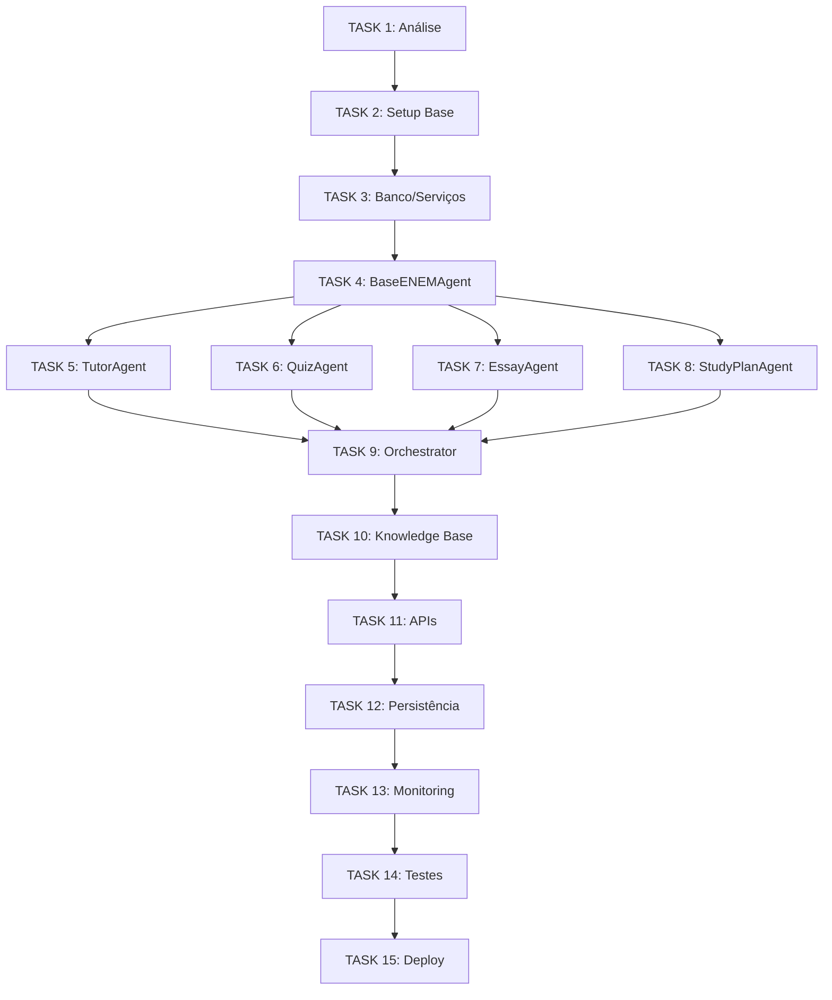

# 🚀 ROADMAP - Edtech Agent API

## 📋 Visão Geral

**Objetivo**: Reproduzir os 6 agentes da POC (documentados em AGENTES_MAPEAMENTO.md) usando a estrutura do projeto ubyfol-platform como base.

**Cronograma Estimado**: 12-15 tasks principais, desenvolvimento iterativo e modular.

---

## 🏗️ FASE 1 - Setup e Estrutura Base (Tasks 1-4)

### ✅ TASK 1: Análise e Planejamento *(Concluído)*
- [x] Análise completa do AGENTES_MAPEAMENTO.md
- [x] Estudo do projeto ubyfol-platform/backend
- [x] Análise do agent dr_ubyfol como padrão ouro
- [x] Setup da estrutura .claude/ e tasks/

### 🔄 TASK 2: Setup da Estrutura Base do Projeto
**Status**: Pendente
**Dependências**: Task 1
**Descrição**: 
- Copiar estrutura base do ubyfol-platform/backend
- Adaptar configurações para o projeto edtech
- Setup inicial do pyproject.toml, requirements
- Configurar .env.example e docker-compose.yml

### 🔄 TASK 3: Configuração de Banco de Dados e Serviços
**Status**: Pendente  
**Dependências**: Task 2
**Descrição**:
- Adaptar models.py para agentes ENEM
- Configurar PostgreSQL para chat history e memory
- Setup Qdrant para knowledge base (PDFs ENEM)
- Configurar Redis para cache (se necessário)

### 🔄 TASK 4: Implementar BaseENEMAgent
**Status**: Pendente
**Dependências**: Task 3
**Descrição**:
- Criar classe abstrata BaseENEMAgent
- Sistema de logs e métricas
- Gerenciamento de sessões e contexto
- Health checks automatizados
- Sistema de tools integrado

---

## 🤖 FASE 2 - Agentes Principais (Tasks 5-10)

### 🔄 TASK 5: Implementar TutorAgent
**Status**: Pendente
**Dependências**: Task 4
**Descrição**:
- Tutor educacional para todas as 13 matérias do ENEM
- Temperature: 0.7, Max tokens: 2048
- Tools: histórico, estatísticas, recomendações
- Sistema de adaptação de linguagem

### 🔄 TASK 6: Implementar QuizAgent  
**Status**: Pendente
**Dependências**: Task 4
**Descrição**:
- Gerador e avaliador de quizzes estilo ENEM
- Temperature: 0.4, Max tokens: 3000
- 3 níveis de dificuldade (fácil, médio, difícil)
- Sistema de correção automática e analytics

### 🔄 TASK 7: Implementar EssayGraderAgent
**Status**: Pendente  
**Dependências**: Task 4
**Descrição**:
- Corretor baseado nas 5 competências ENEM
- Temperature: 0.2, Max tokens: 4000
- Escalas de pontuação oficiais (0-200 pontos)
- Feedback detalhado e construtivo

### 🔄 TASK 8: Implementar StudyPlanAgent
**Status**: Pendente
**Dependências**: Task 4
**Descrição**:
- Planos de estudo personalizados e adaptativos
- Temperature: 0.3, Max tokens: 3000
- 4 níveis de intensidade de estudo
- Cronogramas semanais detalhados

### 🔄 TASK 9: Implementar OrchestratorAgent
**Status**: Pendente
**Dependências**: Tasks 5-8
**Descrição**:
- Coordenação central de todos os agentes
- Roteamento inteligente de mensagens
- Sistema de comandos (/help, /status, etc.)
- Gerenciamento de sessões ativas

### 🔄 TASK 10: Sistema de Conhecimento ENEM
**Status**: Pendente
**Dependências**: Tasks 5-9
**Descrição**:
- Knowledge base com conteúdos ENEM
- Configurar Qdrant para busca semântica
- Integração com todos os agentes
- Sistema de chunking para PDFs educacionais

---

## 🔗 FASE 3 - APIs e Integração (Tasks 11-13)

### 🔄 TASK 11: Implementar APIs RESTful
**Status**: Pendente
**Dependências**: Task 9
**Descrição**:
- Endpoints para cada agente (/tutor, /quiz, /essay, /plan)
- Sistema de autenticação e sessões
- Middleware de logging e métricas
- Documentação automática (FastAPI/Swagger)

### 🔄 TASK 12: Sistema de Persistência
**Status**: Pendente
**Dependências**: Task 11
**Descrição**:
- Chat history persistence (PostgreSQL)
- User memories e preferências
- Estatísticas e analytics por usuário
- Sistema de backup e recovery

### 🔄 TASK 13: Health Checks e Monitoramento  
**Status**: Pendente
**Dependências**: Task 12
**Descrição**:
- Health checks para todos os serviços
- Métricas de performance e uso
- Logging estruturado
- Sistema de alertas (opcional)

---

## 🚀 FASE 4 - Testes e Deploy (Tasks 14-15)

### 🔄 TASK 14: Testes Automatizados
**Status**: Pendente
**Dependências**: Task 13
**Descrição**:
- Testes unitários para cada agente
- Testes de integração APIs
- Testes de performance e carga
- Coverage report e CI/CD setup

### 🔄 TASK 15: Containerização e Deploy
**Status**: Pendente
**Dependências**: Task 14
**Descrição**:
- Docker images otimizadas
- Docker-compose para desenvolvimento
- Scripts de deploy e migração
- Documentação completa do projeto

---

## 🎯 Critérios de Sucesso

### Funcionalidades Obrigatórias
- [ ] Todos os 6 agentes funcionais e integrados
- [ ] APIs RESTful completas e documentadas
- [ ] Sistema de persistência de conversas
- [ ] Knowledge base ENEM integrada
- [ ] Health checks e monitoramento

### Qualidade e Performance
- [ ] Cobertura de testes > 80%
- [ ] Tempo de resposta < 5s por consulta
- [ ] Sistema resiliente a falhas
- [ ] Logs estruturados e informativos

### Compatibilidade
- [ ] 100% compatível com estrutura ubyfol-platform
- [ ] Mesmo padrão de código do dr_ubyfol
- [ ] Docker-compose funcional
- [ ] Configurações via .env

---

## 📊 Dependências Críticas

---

## ⚠️ Pontos de Atenção

### Consultar Antes de Implementar
1. **Integração com Google Gemini**: Verificar se ubyfol-platform usa mesma versão
2. **Sistema de Tools**: Adaptar tools do Agno para estrutura atual
3. **Vector Database**: Confirmar uso do Qdrant vs outras opções
4. **Autenticação**: Sistema de usuários e sessões

### Possíveis Bloqueios
1. **API Keys**: Google Gemini, OpenAI (backup)
2. **Performance**: Gemini 1.5 Flash vs outras versões
3. **Storage**: Tamanho da knowledge base ENEM
4. **Memory**: Sistema de personalização por usuário

---

## 📈 Timeline Estimado

- **Semana 1**: Tasks 1-4 (Setup e Base)
- **Semana 2-3**: Tasks 5-8 (Agentes Principais)  
- **Semana 4**: Tasks 9-10 (Orchestrator e Knowledge)
- **Semana 5**: Tasks 11-13 (APIs e Integração)
- **Semana 6**: Tasks 14-15 (Testes e Deploy)

**Total**: ~6 semanas de desenvolvimento, com possibilidade de paralelização das Tasks 5-8.

---

*Roadmap criado em: 2025-08-12*  
*Última atualização: 2025-08-12*